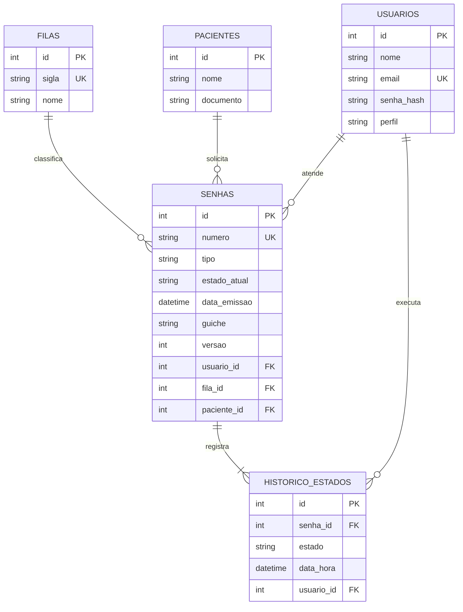

# Diagrama Entidade-Relacionamento (ER) — LabManager

Modelo relacional implementado com SQLAlchemy e SQLite/MySQL.

```mermaid
erDiagram
    FILAS {
        int id PK
        string sigla UK
        string nome
    }

    USUARIOS {
        int id PK
        string nome
        string email UK
        string senha_hash
        string perfil
    }

    PACIENTES {
        int id PK
        string nome
        string documento
    }

    SENHAS {
        int id PK
        string numero UK
        string tipo
        string estado_atual
        datetime data_emissao
        string guiche
        int versao
        int usuario_id FK
        int fila_id FK
        int paciente_id FK
    }

    HISTORICO_ESTADOS {
        int id PK
        int senha_id FK
        string estado
        datetime data_hora
        int usuario_id FK
    }

    FILAS ||--o{ SENHAS : classifica
    PACIENTES ||--o{ SENHAS : solicita
    USUARIOS ||--o{ SENHAS : atende
    SENHAS ||--|{ HISTORICO_ESTADOS : registra
    USUARIOS ||--o{ HISTORICO_ESTADOS : executa
```